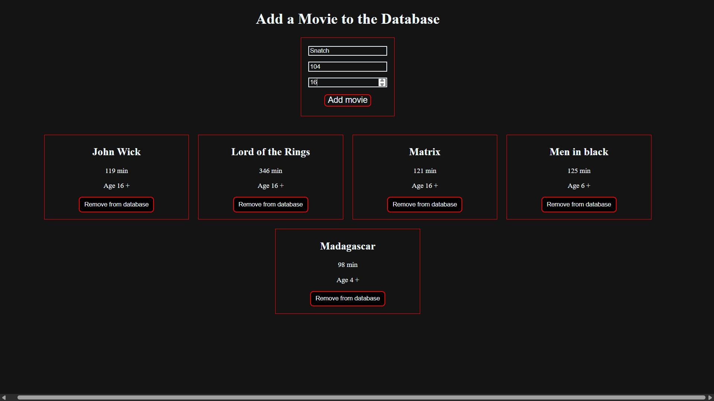
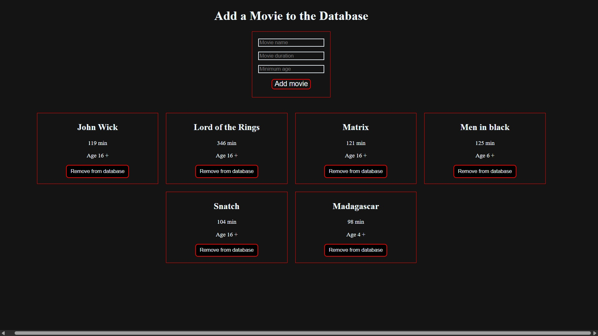
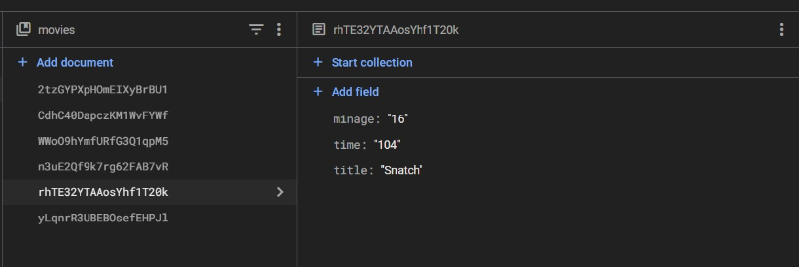

# 🎬 Movie Manager App

A simple React application to **add, view, and delete movies** using **Firebase Firestore** as a real-time cloud database.

---

## 🛠️ Features

- ✅ Add a movie with:
  - Title
  - Duration (minutes)
  - Minimum age requirement
- ✅ View a live list of all saved movies
- ✅ Delete movies from the database
- ✅ Real-time Firestore sync (no page reload)
- ✅ Custom dark-themed styling with CSS

---

## ⚙️ Tech Stack

- **React** – Functional components and Hooks
- **Firebase Firestore** – NoSQL database
- **CSS** – Manual layout and styling

---

## 📸 Preview

 
 
 

